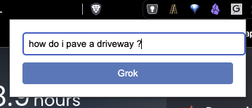
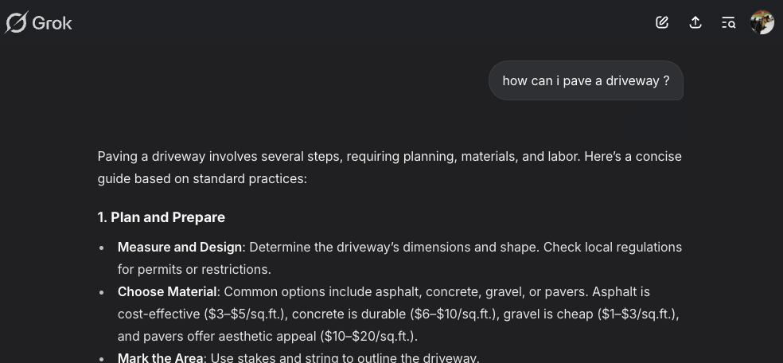

# Grok Direct Chrome Extension

A Chrome extension that allows you to quickly search Grok directly from your browser.

## Features

- Quick search interface accessible from your browser toolbar
- Automatically opens or switches to a Grok tab
- Seamlessly pastes your search query and executes the search
- Works with both Chrome and Brave browsers

## Installation

1. Download or clone this repository
2. Open Chrome/Brave and navigate to `chrome://extensions/`
3. Enable "Developer mode" in the top right corner
4. Click "Load unpacked" and select the directory containing the extension files

## Usage

1. Click the Grok Direct icon in your browser toolbar
2. Enter your search query in the popup window
3. Press Enter or click the "Search on Grok" button
4. The extension will either:
   - Open a new Grok tab if one doesn't exist
   - Switch to an existing Grok tab if one is already open
5. Your search will be automatically executed on Grok

## Quick Start: How to Use Grok Direct

1. **Open the Grok Direct extension popup** (by clicking the icon):

   

2. **Type your question and submit.** Grok.com will open (or be focused), your question will be pasted and submitted automatically, and you'll see the response:

   

## Development

The extension consists of the following files:
- `manifest.json`: Extension configuration
- `popup.html`: Search interface
- `popup.js`: Popup functionality
- `background.js`: Background service worker for tab management
- `icons/`: Directory containing extension icons

## Requirements

- Chrome or Brave browser
- Internet connection to access Grok

## License

MIT License 